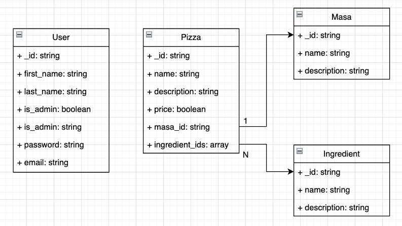

# TEA 3 - Extensión de funcionalidad

## Sistema de comunicación utilizado
- Tecnología: RestAPI implementado en una aplicación de Flask, usando python.
- Razón por elegir esta tecnología: Experienca previa, simplicidad, facilidad de comunicación entre diferentes lenguajes
- IP: Localhost
- puerto: 5002
- Prefijo para todos los endpoints: pizzalgust/
- Ejemplo: `http://localhost:5002/pizzalgust/login

## Sistema de autenticación
- Tecnología: JSON Web Token (JWT)
- Razón por elegir esta tecnología: Experienca previa.
- Notas: Normalmente un JWT se ha de pasar en los `headers` de una petición. 
  - Por simplicidad, en este TEA el token se pasa dentro del `body`. 
  - En el próximo TEA planeo arreglar esto.
  
## Descripción de los endpoints
####  POST `/login`
Inicia sesión con las credenciales proporcionadas y devuelve un token de autenticación junto con los detalles del usuario.

**Parámetros de Entrada**
email (cadena): Correo electrónico del usuario.
password (cadena): Contraseña del usuario.
```POST /login HTTP/1.1
Content-Type: application/json

{
    "email": "bwayne@gotham.com",
    "password": "batman"
}
```
**Respuestas**
- Código 200: Se devuelve cuando el inicio de sesión es exitoso. Se proporciona un token de autenticación junto con los detalles del usuario.
```
{
    "msg": "Inicio de sesión exitoso",
    "user_name": "bwayne",
    "first_name": "Bruce",
    "last_name": "Wayne",
    "is_admin": true,
    "token": "token_de_autenticacion"
}
```

- Código 400: Se devuelve si los datos de inicio de sesión son incorrectos o faltantes.
- Código 410: Se devuelve si el usuario no está en la base de datos.
- Código 401: Se devuelve si la contraseña del usuario es incorrecta.
- Código 500: Se devuelve con cualquier otro error no contemplado en los ya mencionados.

####  POST `/logout`
Inicia sesión con las credenciales proporcionadas y devuelve un token de autenticación junto con los detalles del usuario.

**Parámetros de Entrada**
token (cadena): token de autenticación enviado al `login`

```POST /login HTTP/1.1
Content-Type: application/json

{
    "token": "token",
}
```
**Respuestas**
- Código 200: Se devuelve cuando el inicio de sesión es exitoso. Se proporciona un token de autenticación junto con los detalles del usuario.
```
{
    "msg": "Logout realizado con éxito",
}
```

- Código 400: Se devuelve si los datos de inicio de sesión son incorrectos o faltantes.
- Código 410: Se devuelve si el usuario no está en la base de datos.
- Código 401: Se devuelve si el usuario no ha hecho log in. 
- Código 500: Se devuelve con cualquier otro error no contemplado en los ya mencionados.

####  POST `/get-all-users`
Devuelve una lista con todos los usuarios. Sólo funciona si la petición viene de un usuario admin.

**Parámetros de Entrada**
token (cadena): token de autenticación enviado al `login`

```POST /get-all-users HTTP/1.1
Content-Type: application/json

{
    "token": "token",
}
```
**Respuestas**
- Código 200: Se devuelve cuando el inicio de sesión es exitoso. Se proporciona un token de autenticación junto con los detalles del usuario.
```
{'users': 
    [{'_id': '65ef5d26bd17175093180e23',
  'email': 'bwayne@gotham.com',
  'first_name': 'Bruce',
  'is_admin': True,
  'last_name': 'Wayne',
  'user_name': 'bwayne',
  'user_type': 'admin'},
 {'_id': '65ef5f88ee038e9346215ec9',
  'email': 'pparker@newyork.com',
  'first_name': 'Peter',
  'is_admin': False,
  'last_name': 'Parker',
  'user_name': 'pparker',
  'user_type': 'cliente'},
 {'_id': '65ef5f89ee038e9346215ecb',
  'email': 'ckent@world.com',
  'first_name': 'Clark',
  'is_admin': False,
  'last_name': 'Kent',
  'user_name': 'ckent',
  'user_type': 'cocinero'}],
}
```

- Código 400: Se devuelve si los datos de inicio de sesión son incorrectos o faltantes.
- Código 410: Se devuelve si el usuario no está en la base de datos.
- Código 401: Se devuelve si el usuario no ha hecho log in o si el usuario no es admin.
- Código 500: Se devuelve con cualquier otro error no contemplado en los ya mencionados.

####  POST `/create-user`
Crea un nuevo usuario en la base de datos.

**Parámetros de Entrada**
user_name (cadena): El nombre de usuario del usuario.
email (cadena): El email del usuario.
first_name (cadena): El nombre del usuario.
last_name (cadena): El apellido del usuario.
password (cadena): La contraseña elegida por el usuario.

```POST /create-user HTTP/1.1
Content-Type: application/json

{
    'user_name': 'homer',
    'email': 'hsimpson@springfield.com',
    'first_name': 'Homer',
    'last_name': 'Simpson',
    'password': 'stupidflanders'
}
```
**Respuestas**
- Código 200: Se devuelve cuando el inicio de sesión es exitoso. Se proporciona un token de autenticación junto con los detalles del usuario.
```
{
    "msg": "Usuario creado con éxito",
    "user_id": "65ef5f89ee038e9346215ecb"
}
```

- Código 400: Se devuelve si los datos de inicio de sesión son incorrectos o faltantes.
- Código 410: Se devuelve si el usuario no está en la base de datos.
- Código 500: Se devuelve con cualquier otro error no contemplado en los ya mencionados.

####  DELETE `/delete-user`
Borra el usuario correspondiente al user_id enviado. Sólo funciona si la petición viene de un usuario admin.

**Parámetros de Entrada**
token (cadena): token de autenticación enviado al `login`
user_id (cadena): Id del usuario que se quiere borrar. Se puede conseguir con `get-all-users`

```DELETE /delete-user HTTP/1.1
Content-Type: application/json

{
    "token": "token",
    "user_id": "65ef5f89ee038e9346215ecb"
}
```
**Respuestas**
- Código 200: Se devuelve cuando el usuario se ha borrado con éxito.
```
{'msg': 'Usuario borrado con éxito'}
```

- Código 400: Se devuelve si los datos de inicio de sesión son incorrectos o faltantes.
- Código 410: Se devuelve si el usuario no está en la base de datos.
- Código 401: Se devuelve si el usuario no ha hecho log in o si el usuario no es admin.
- Código 500: Se devuelve con cualquier otro error no contemplado en los ya mencionados.

####  PUT `/update-user`
Actualiza los datos del usuario. Los parámetros de entrada son opcionales (se puede mandar lo que se quiera).

Si la petición viene de un usuario que *no* es admin, se actualizan los datos del propio usuario. 

Si la petición viene de un usuario administrador, es **OBLIGATORIO** enviar un parámetro `user_id` para saber los datos
de qué usuario hay que actualizar.

**Parámetros de Entrada**
token (cadena): token de autenticación enviado al `login`

Cualquier campo de los contemplados en create_user, menos password:
user_name (cadena)
email (cadena)
first_name
last_name (cadena)

*Solo si la petición viene de un admin*:
user_id (cadena): Id del usuario que se quiere actualizar. Se puede conseguir con `get-all-users`

```PUT /update-user HTTP/1.1
Content-Type: application/json

{
    "token": "token",
    "first_name": "Wenceslao",
    "last_name": "Jiménez"
}
```
**Respuestas**
- Código 200: Se devuelve cuando el usuario se ha borrado con éxito.
```
{'msg': 'Usuario actualizado con éxito'}
```

- Código 400: Se devuelve si los datos de inicio de sesión son incorrectos o faltantes.
- Código 410: Se devuelve si el usuario no está en la base de datos.
- Código 401: Se devuelve si el usuario no ha hecho log in o si el usuario no es admin.
- Código 500: Se devuelve con cualquier otro error no contemplado en los ya mencionados.


####  POST `/get-all-pizzas`
Devuelve una lista con todas las pizzas.

**Parámetros de Entrada**
token (cadena): token de autenticación enviado al `login`

```POST /get-all-pizzas HTTP/1.1
Content-Type: application/json

{
    "token": "token",
}
```
**Respuestas**
- Código 200: Se devuelve cuando el inicio de sesión es exitoso. Se proporciona un token de autenticación junto con los detalles del usuario.
```
{
   'pizzas': [
        {'_id': '662cc64aaaa4cf8c845499ac',
         'description': 'Pizza con tomate, queso mozzarela y albahaca',
         'name': 'Margarita',
         'price': 10.5},
        {'_id': '662cc65eaaa4cf8c845499b3',
         'description': 'Pizza con huevo, bacon y parmesano',
         'name': 'Carbonara',
         'price': 12.5},
        {'_id': '662cc676aaa4cf8c845499cb',
         'description': 'Pizza con pollo, bacon y piña',
         'name': 'Hawaianna',
         'price': 14.5},
    ],
}
```

- Código 400: Se devuelve si los datos de inicio de sesión son incorrectos o faltantes.
- Código 410: Se devuelve si el usuario no está en la base de datos.
- Código 401: Se devuelve si el usuario no ha hecho log in.
- Código 500: Se devuelve con cualquier otro error no contemplado en los ya mencionados.

####  POST `/create-pizza`
Crea un nueva usuario en la base de datos.

**Parámetros de Entrada**
token (cadena): El token de login del usuario.
name (cadena): El nombre de la pizza
price (número decimal): El precio de la pizza.
descr (cadena): DEscripción básica de la pizza.

```POST /create-pizza HTTP/1.1
Content-Type: application/json

{
    'token':'token',
    'name':"Marina",
    'price':10.5,
    'descr': "Pizza con marisco, pescado y queso"
}
```
**Respuestas**
- Código 200: Se devuelve cuando la pizza se crea con éxito.
```
{
    'msg': 'Pizza creada con éxito', 
    'pizza_id': '662fc94943bf55d878cb248e'
}
```

- Código 400: Se devuelve si los datos de inicio de sesión son incorrectos o faltantes.
- Código 410: Se devuelve si el usuario no está en la base de datos.
- Código 500: Se devuelve con cualquier otro error no contemplado en los ya mencionados.

####  DELETE `/delete-pizza`
Borra el usuario correspondiente al user_id enviado. Sólo funciona si la petición viene de un usuario admin.

**Parámetros de Entrada**
token (cadena): token de autenticación enviado al `login`
pizza_id (cadena): Id de la pizza que se quiere borrar. Se puede conseguir con `get-all-pizzas`

```DELETE /delete-pizza HTTP/1.1
Content-Type: application/json

{
    "token": "token",
    "pizza_id": "65ef5f89ee038e9346215ecb"
}
```
**Respuestas**
- Código 200: Se devuelve cuando la pizza se ha borrado con éxito.
```
{'msg': 'Pizza borrada con éxito'}
```

- Código 400: Se devuelve si los datos de inicio de sesión son incorrectos o faltantes.
- Código 410: Se devuelve si el usuario no está en la base de datos.
- Código 401: Se devuelve si el usuario no ha hecho log in o si el usuario no es admin.
- Código 500: Se devuelve con cualquier otro error no contemplado en los ya mencionados.

####  PUT `/update-pizza`
Actualiza los datos de la pizza. Los parámetros de entrada son opcionales (se puede mandar lo que se quiera).

Es **OBLIGATORIO** enviar un parámetro `pizza_id` para saber los datos
de qué pizza hay que actualizar.

**Parámetros de Entrada**
token (cadena): token de autenticación enviado al `login`

Cualquier campo de los contemplados en create_pizza:
name (cadena): El nombre de la pizza
price (número decimal): El precio de la pizza.
descr (cadena): DEscripción básica de la pizza.

*Solo si la petición viene de un admin*:
user_id (cadena): Id del usuario que se quiere actualizar. Se puede conseguir con `get-all-users`

```PUT /update-pizza HTTP/1.1
Content-Type: application/json

{
    'token': token,
    'name': 'Milán',
    'pizza_id': "65ef5f89ee038e9346215ecb",
    'description': "Pizza con un bistec, bacon y queso"
}
```
**Respuestas**
- Código 200: Se devuelve cuando el usuario se ha borrado con éxito.
```
{'msg': 'Pizza actualizada con éxito'}
```

- Código 400: Se devuelve si los datos de inicio de sesión son incorrectos o faltantes.
- Código 410: Se devuelve si el usuario no está en la base de datos.
- Código 401: Se devuelve si el usuario no ha hecho log in o si el usuario no es admin.
- Código 500: Se devuelve con cualquier otro error no contemplado en los ya mencionados.

####  POST `/get-all-masas`
Devuelve una lista con todas las masas.

**Parámetros de Entrada**
token (cadena): token de autenticación enviado al `login`

```POST /get-all-masas HTTP/1.1
Content-Type: application/json

{
    "token": "token",
}
```
**Respuestas**
- Código 200: Se devuelve cuando el inicio de sesión es exitoso. Se proporciona un token de autenticación junto con los detalles del usuario.
```
{
   'masas': [
        {'_id': '662cc64aaaa4cf8c845499ac',
         'description': 'Masa tradicional de harina blanca',
         'name': 'Trigo'},
        {'_id': '662cc65eaaa4cf8c845499b3',
         'description': 'Masa de centeno, muy deliciosa',
         'name': 'Centeno'},
        {'_id': '662cc676aaa4cf8c845499cb',
         'description': 'Masa con relleno de queso, genial para engordar',
         'name': 'Con queso'},
    ],
}
```

- Código 400: Se devuelve si los datos de inicio de sesión son incorrectos o faltantes.
- Código 410: Se devuelve si el usuario no está en la base de datos.
- Código 401: Se devuelve si el usuario no ha hecho log in.
- Código 500: Se devuelve con cualquier otro error no contemplado en los ya mencionados.

####  POST `/create-masa`
Crea un nueva usuario en la base de datos.

**Parámetros de Entrada**
token (cadena): El token de login del usuario.
name (cadena): El nombre de la masa
description (cadena): DEscripción básica de la masa.

```POST /create-masa HTTP/1.1
Content-Type: application/json

{
    'token':'token',
    'name': 'Trigo',
    'description': 'Masa tradicional de harina blanca'
}
```
**Respuestas**
- Código 200: Se devuelve cuando la masa se crea con éxito.
```
{
    'msg': 'Masa creada con éxito', 
    'masa_id': '662fc94943bf55d878cb248e'
}
```

- Código 400: Se devuelve si los datos de inicio de sesión son incorrectos o faltantes.
- Código 410: Se devuelve si el usuario no está en la base de datos.
- Código 500: Se devuelve con cualquier otro error no contemplado en los ya mencionados.


####  POST `/get-all-ingredients`
Devuelve una lista con todas las ingredients.

**Parámetros de Entrada**
token (cadena): token de autenticación enviado al `login`

```POST /get-all-ingredients HTTP/1.1
Content-Type: application/json

{
    "token": "token",
}
```
**Respuestas**
- Código 200: Se devuelve cuando el inicio de sesión es exitoso. Se proporciona un token de autenticación junto con los detalles del usuario.
```
{
   'ingredients': [
        {'_id': '662cc64aaaa4cf8c845499ac',
         'description': 'Anchoas de loas mares del Norte',
         'name': 'Anchoas'},
        {'_id': '662cc65eaaa4cf8c845499b3',
         'description': 'Olivas del olivero del abuelo Paco',
         'name': 'Olivas'},
        {'_id': '662cc676aaa4cf8c845499cb',
         'description': 'Sobrasada super sabrosa. La llamamos la triple S',
         'name': 'Sobrasada'},
    ],
}
```

- Código 400: Se devuelve si los datos de inicio de sesión son incorrectos o faltantes.
- Código 410: Se devuelve si el usuario no está en la base de datos.
- Código 401: Se devuelve si el usuario no ha hecho log in.
- Código 500: Se devuelve con cualquier otro error no contemplado en los ya mencionados.

####  POST `/create-ingredient`
Crea un nueva usuario en la base de datos.

**Parámetros de Entrada**
token (cadena): El token de login del usuario.
name (cadena): El nombre de la ingredient
description (cadena): DEscripción básica de la ingredient.

```POST /create-ingredient HTTP/1.1
Content-Type: application/json

{
    'token':'token',
    'name': 'Trigo',
    'description': 'ingredient tradicional de harina blanca'
}
```
**Respuestas**
- Código 200: Se devuelve cuando la ingredient se crea con éxito.
```
{
    'msg': 'ingredient creada con éxito', 
    'ingredient_id': '662fc94943bf55d878cb248e'
}
```

- Código 400: Se devuelve si los datos de inicio de sesión son incorrectos o faltantes.
- Código 410: Se devuelve si el usuario no está en la base de datos.
- Código 500: Se devuelve con cualquier otro error no contemplado en los ya mencionados.
  

## Diagrama UML clases
- Nota: En python todos los métodos y variables son públicos
